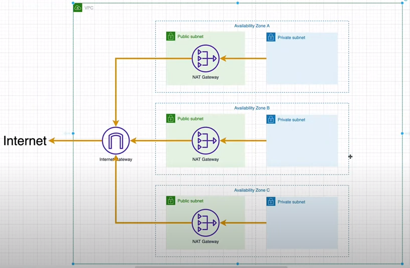

# Resources
### Provisionando recursos na AWS com o Terraform

- Instancias EC2
- Bucket S3
- Banco de Dados DynamoDB
- VPC

##### VPC

Foi construído na AWS uma Virtual Private Cloud contendo 6 subnets (sendo 3 públicas e 3 privadas), em 3 availability zones, agrupando cada par em 3 NAT Gateway (tradução do ip privado pra um ip público a fim das instâncias da subnet privada poderem se comunicar com serviços externos à VPC)


- [backend.tf] - onde terraform define/salva seu estado (descritivo e atualizações de toda a infra controlada), que poderia ser um bucket da aws mas vou utilizar o Terraform Cloud¹ pra persistir o estado e pra efeito de estudos atende bem
- [vpc.tf] 
        - subnets como uma lista de mapas numa quantidade definida (vars), iterando por cada item (foreach)
        - consultar/buscar um id disponivel de uma availability zones (data) 
        - filtrar as subnets e também parear 1 subnet pública com 1 subnet privada (locals)

¹[Terraform Cloud](https://app.terraform.io/)


######  Run
```sh
terraform init
terraform plan
terraform apply
```
